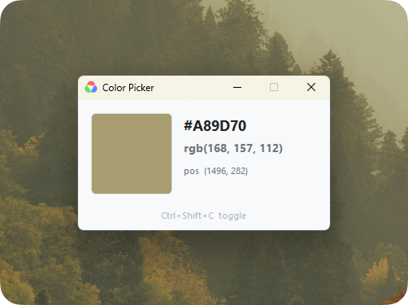

<p align="center">
  
</p>

<h1 align="center">Color Picker</h1>

<p align="center">
  A lightweight, always-on-top screen colour picker for Windows.
</p>

<p align="center">
  
</p>

---

## Features

- Reads the pixel colour under your cursor in real time
- Displays hex value and `rgb()` notation
- Always on top — never lost behind other windows
- Minimises to the system tray
- Global hotkey **Ctrl + Shift + C** to show / hide from anywhere
- Zero dependencies — single portable `.exe`

## Download

Grab the latest `ColorPicker.exe` from [Releases](../../releases).

## Build from source

**Requirements:** Visual Studio 2019 or later with the C++ Desktop workload.

```bat
build.bat
```

Output: `build\ColorPicker.exe`

Or with CMake:

```bat
cmake -B build -G "Visual Studio 17 2022"
cmake --build build --config Release
```

## Usage

| Action | Result |
|--------|--------|
| Move cursor | Live colour update |
| Minimize / Close | Hides to system tray |
| Tray icon double-click | Restore window |
| **Ctrl + Shift + C** | Toggle from anywhere |

## License

[MIT](LICENSE)
